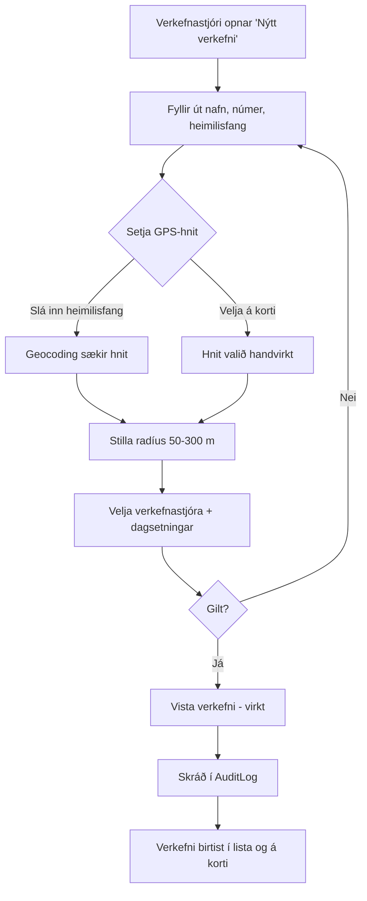
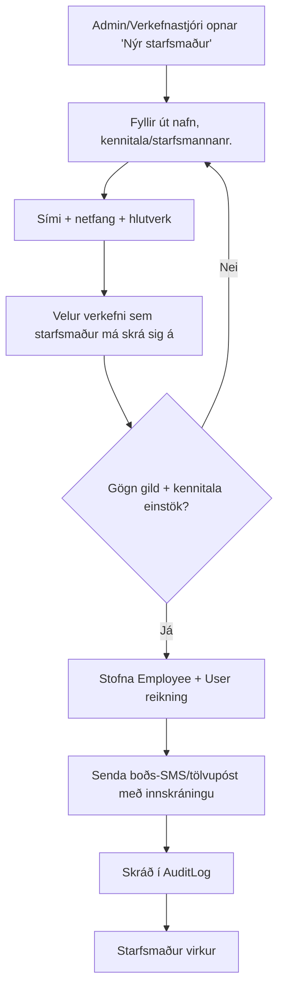
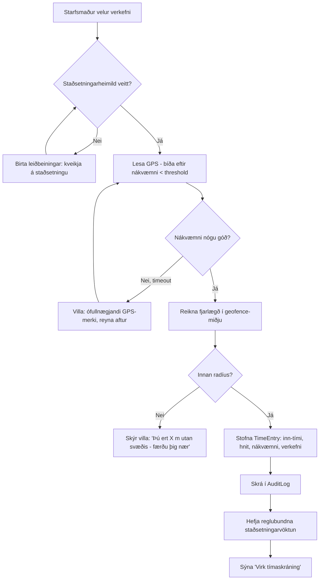
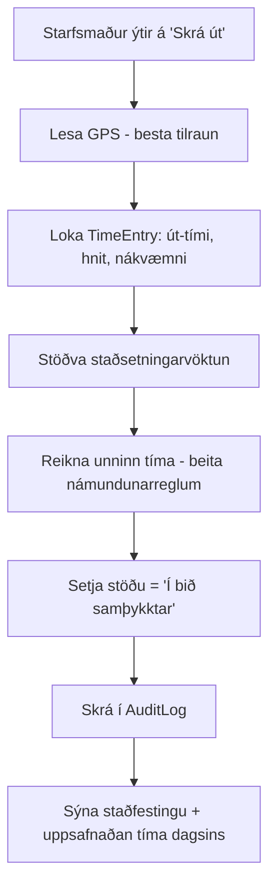
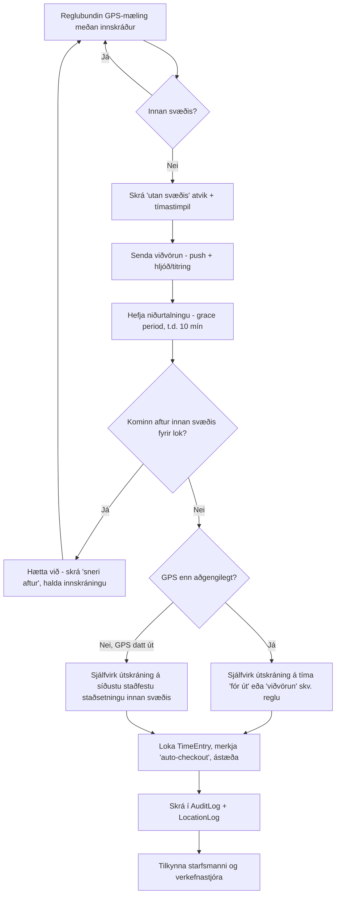
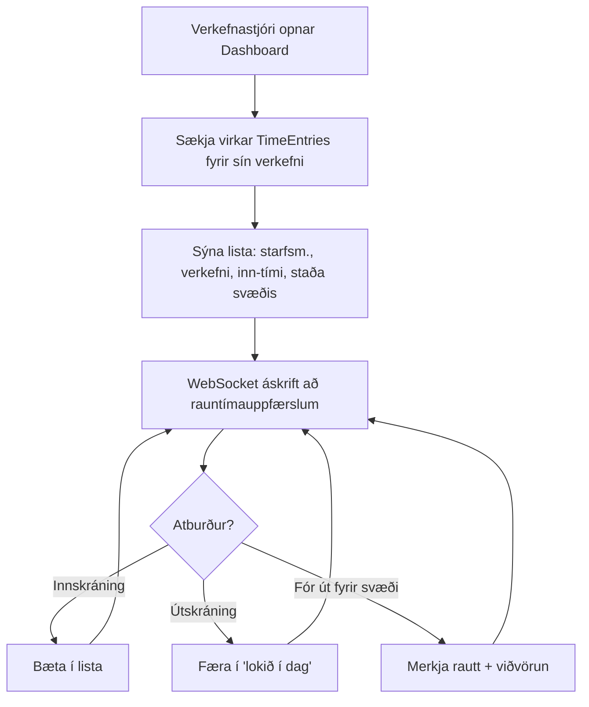
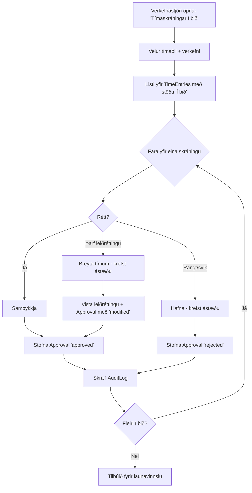
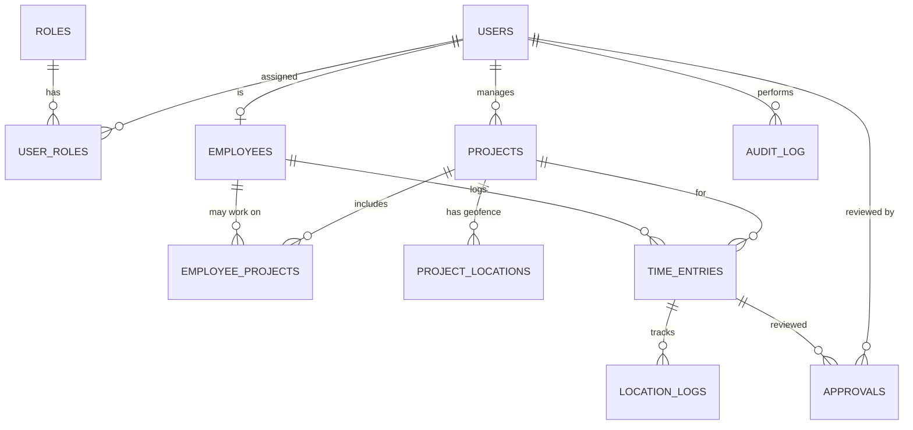

# Tímastjórnunarkerfi með GPS-staðsetningu — Hönnunarskjal

**Útgáfa:** 0.1 (drög til samþykktar)
**Dagsetning:** 19. júní 2026
**Staða:** Hönnun — **engin forritun hafin**

> Þetta skjal er grunnur sem þarf að lesa og samþykkja áður en forritun hefst. Allar ákvarðanir eru rökstuddar og opnar spurningar dregnar saman í lokin (kafli 12).

### Samþykktar grunnákvarðanir (19/6/2026)
| Ákvörðun | Val | Áhrif |
|---|---|---|
| **Innskráning** | OTP við nýskráningu + **PIN** fyrir daglega innskráningu | Sjá kafla 8.1. SMS-veitu þörf fyrir OTP. |
| **Kennitala** | Geymd, **dulkóðuð í hvíld** | Einstök auðkenning; viðkvæm gögn varin (kafli 8). |
| **Launareglur** | **Hráir tímar í MVP** (yfirvinna/hlé reiknað í launakerfi síðar) | Einfaldari MVP; námundun/hlé fer í v2 (kafli 10/11). |
| **Umfang** | **Multi-tenant (SaaS) frá byrjun** | `companies`-tafla + `tenant_id` á öllum töflum + tenant-scoping í RBAC (kafli 6/8). |
| **SMS/OTP** | Byrja á **fríu/ódýru**, abstrakt á bak við `SmsProvider`-viðmót | Hægt að skipta um veitu án kóðabreytinga (kafli 8.1). |
| **Bakgrunns-GPS** | **„Always allow location" á fyrirtækjasímum** | Áreiðanleg bakgrunnsvöktun; minnkar stærstu tæknilegu áhættuna (kafli 9). |
| **Svæði per verkefni** | **Eitt** hringlaga svæði í MVP | Einfaldara UI; taflan styður fleiri síðar (kafli 6). |
| **Útflutningur** | **Excel (.xlsx)** til að byrja með | CSV/launakerfis-tenging síðar (kafli 7/10). |
| **Skali** | ~**10–100 starfsmenn** | Lítill skali → ein managed Postgres dugar, einföld hýsing (kafli 12). |
| **Hýsing** | **Ódýrasta nothæfa** (frítt í byrjun) | Sjá ráðlagða stakkinn í kafla 12.1. |

---

## Efnisyfirlit
1. [Kerfislýsing](#1-kerfislýsing)
2. [Notendahlutverk](#2-notendahlutverk)
3. [Ferli fyrir hvert hlutverk](#3-ferli-fyrir-hvert-hlutverk)
4. [Flæðirit](#4-flæðirit)
5. [Wireframes / skjámyndalýsingar](#5-wireframes--skjámyndalýsingar)
6. [Gagnagrunnshönnun](#6-gagnagrunnshönnun)
7. [API tillaga](#7-api-tillaga)
8. [Öryggi og GDPR](#8-öryggi-og-gdpr)
9. [Svör við mikilvægum spurningum](#9-svör-við-mikilvægum-spurningum)
10. [MVP útgáfa](#10-mvp-útgáfa)
11. [Næstu útgáfur](#11-næstu-útgáfur)
12. [Tæknistakkur og opnar spurningar](#12-tæknistakkur-og-opnar-spurningar)

---

## 1. Kerfislýsing

### 1.1 Tilgangur
Kerfi sem heldur utan um **verkefni**, **starfsmenn** og **tímaskráningar** fyrir fyrirtæki sem rekur mörg verkefni á mismunandi landfræðilegum staðsetningum (t.d. verktaka, byggingafyrirtæki, þrif, viðhald, mannvirkjagerð). Kjarnaeiginleikinn er **staðsetningarbundin tímaskráning**: starfsmaður getur aðeins skráð sig inn á verkefni ef hann er staddur innan skilgreinds svæðis (geofence) verkefnisins, og kerfið fylgist með staðsetningu á meðan á vinnu stendur.

### 1.2 Meginmarkmið
- **Rétt og rekjanleg tímaskráning** sem hægt er að treysta fyrir launavinnslu.
- **Sjálfvirkni** sem minnkar handvirka vinnu verkefnastjóra og dregur úr villum.
- **Eftirlit í rauntíma** með því hverjir eru við vinnu, hvar og hvort þeir séu innan svæðis.
- **Persónuvernd og lögmæti** — staðsetningargögn eru viðkvæm; kerfið safnar lágmarki og er gagnsætt.

### 1.3 Kerfishlutar (high-level)
```
┌─────────────────────┐         ┌──────────────────────────┐
│  Mobile app          │         │  Web-stjórnborð           │
│  (starfsmaður)       │         │  (stjórnendur)            │
│  iOS / Android       │         │  React SPA                │
└──────────┬──────────┘         └────────────┬─────────────┘
           │  HTTPS / REST + WSS              │  HTTPS / REST + WSS
           └───────────────┬─────────────────┘
                           ▼
                ┌────────────────────────┐
                │   Backend API          │
                │   Auth · Geofence ·    │
                │   Tímalógík · Skýrslur │
                └───────────┬────────────┘
                            ▼
                ┌────────────────────────┐
                │   PostgreSQL + PostGIS │
                │   (+ Redis fyrir       │
                │    rauntíma/cache)     │
                └────────────────────────┘
```

### 1.4 Lykilhugtök
| Hugtak | Skýring |
|---|---|
| **Verkefni (Project)** | Vinnustaður með nafn, númer, heimilisfang, GPS-hnit og leyfilegan radíus. |
| **Geofence** | Hringlaga (eða marghyrnt) svæði kringum GPS-hnit verkefnis. Radíus 50–300 m. |
| **Tímaskráning (TimeEntry)** | Eitt skipti: inn-tími, út-tími, verkefni, staðsetning við inn/út, athugasemd, staða. |
| **Staðsetningarlog (LocationLog)** | Reglubundnar GPS-mælingar á meðan starfsmaður er skráður inn. |
| **Samþykkt (Approval)** | Aðgerð verkefnastjóra/launafulltrúa: samþykkja eða hafna tímaskráningu. |
| **Sjálfvirk útskráning** | Kerfið lokar tímaskráningu þegar starfsmaður yfirgefur svæði eða GPS dettur út of lengi. |

---

## 2. Notendahlutverk

Hlutverk eru **stigveldi** með aðgangsstýringu (RBAC). Notandi getur haft fleiri en eitt hlutverk (t.d. verkefnastjóri sem líka skráir eigin tíma).

### 2.1 Kerfisstjóri (Admin)
**Ábyrgð:** Heildarumsjón með kerfinu.
- Stofnar/breytir/eyðir notendum og hlutverkum.
- Stillir GPS-reglur (radíus-mörk, hversu oft lesið, viðvörunartími, tími að sjálfvirkri útskráningu).
- Stillir launatengdar reglur (yfirvinnumörk, námundun tíma o.fl.).
- Hefur aðgang að AuditLog og getur flutt út öll gögn.
- Stýrir GDPR-aðgerðum (eyðing, útflutningur persónugagna).

### 2.2 Verkefnastjóri (Project Manager)
**Ábyrgð:** Rekstur eins eða fleiri verkefna.
- Stofnar/breytir verkefnum sem hann ber ábyrgð á.
- Úthlutar starfsmönnum á verkefni.
- Sér lifandi yfirlit yfir innskráða starfsmenn á sínum verkefnum.
- **Samþykkir eða hafnar** tímaskráningum.
- Gerir handvirkar leiðréttingar (skráðar í AuditLog með ástæðu).
- Sér skýrslur fyrir sín verkefni.

### 2.3 Starfsmaður (Employee)
**Ábyrgð:** Skráir eigin vinnutíma.
- Skráir sig inn/út á verkefni gegnum mobile app (háð GPS).
- Bætir við athugasemd við tímaskráningu.
- Sér eigið tímayfirlit og stöðu (samþykkt/í bið/hafnað).
- Getur óskað eftir leiðréttingu (ekki breytt beint).

### 2.4 Laun / bókhald (Payroll)
**Ábyrgð:** Vinnur úr samþykktum tímum til launagreiðslu.
- Sér aðeins **samþykktar** tímaskráningar (að jafnaði skrifvarinn aðgangur).
- Flytur út gögn í Excel/CSV/launakerfi.
- Sér samantektir per starfsmann/verkefni/tímabil.
- Sér **ekki** hráar GPS-slóðir (location logs) — aðeins niðurstöður (innan/utan svæðis: já/nei) til að lágmarka persónugögn. (Sjá kafla 8.)

### 2.5 Aðgangsfylki (yfirlit)
| Aðgerð | Admin | Verkefnastjóri | Starfsmaður | Laun |
|---|:--:|:--:|:--:|:--:|
| Stofna/breyta notendur | ✓ | – | – | – |
| Stofna/breyta verkefni | ✓ | ✓ (sín) | – | – |
| Úthluta starfsm. á verkefni | ✓ | ✓ (sín) | – | – |
| Skrá inn/út | ✓* | ✓* | ✓ | – |
| Samþykkja tíma | ✓ | ✓ (sín) | – | – |
| Handvirk leiðrétting | ✓ | ✓ (sín) | – | – |
| Sjá lifandi yfirlit | ✓ | ✓ (sín) | – | (✓ lesa) |
| Skýrslur / útflutningur | ✓ | ✓ (sín) | eigin | ✓ |
| Stilla GPS/launareglur | ✓ | – | – | – |
| AuditLog | ✓ | (sín verkefni) | – | – |
| GDPR eyðing/útflutningur | ✓ | – | – | – |

\* aðeins ef viðkomandi er sjálfur úthlutaður á verkefnið sem starfsmaður.

---

## 3. Ferli fyrir hvert hlutverk

### 3.1 Kerfisstjóri
1. **Uppsetning fyrirtækis** → stofnar hlutverk, býr til fyrstu verkefnastjóra og launafulltrúa.
2. **Stillingar** → setur sjálfgefin GPS-mörk og launareglur.
3. **Viðhald** → vaktar AuditLog, bregst við GDPR-beiðnum, gerir starfsmenn/verkefni óvirk.

### 3.2 Verkefnastjóri
1. **Stofna verkefni** → fyllir út upplýsingar, setur GPS-hnit (af korti eða heimilisfangi) og radíus.
2. **Manna verkefni** → úthlutar starfsmönnum.
3. **Daglegur rekstur** → fylgist með lifandi yfirliti.
4. **Vikuleg uppgjör** → fer yfir tímaskráningar, samþykkir/hafnar, gerir leiðréttingar með ástæðu.

### 3.3 Starfsmaður
1. **Innskráning í app** (sími/netfang + OTP/lykilorð).
2. **Velur verkefni** úr lista yfir verkefni sem hann má skrá sig á.
3. **Skráir inn** → app athugar GPS → leyfir ef innan svæðis.
4. **Vinnur** → app athugar staðsetningu reglulega í bakgrunni.
5. **Skráir út** (handvirkt) eða er skráður út sjálfvirkt.
6. **Sér yfirlit** og óskar eftir leiðréttingu ef þörf krefur.

### 3.4 Laun / bókhald
1. **Velur tímabil** (t.d. launamánuð).
2. **Staðfestir að allt sé samþykkt** (sér lista yfir óafgreidd).
3. **Flytur út** í CSV/Excel eða beint í launakerfi.
4. **Lokar tímabili** (læsir frekari breytingum á því tímabili).

---

## 4. Flæðirit

> Eftirfarandi eru í Mermaid-sniði. Þú getur séð þau myndræn í hvaða Mermaid-skoðara sem er (t.d. VS Code með Mermaid-viðbót eða GitHub).

### 4.1 Stofnun verkefnis


### 4.2 Stofnun starfsmanns


### 4.3 Innskráning starfsmanns á verkefni


### 4.4 Útskráning starfsmanns (handvirk)


### 4.5 Sjálfvirk útskráning þegar farið er út fyrir GPS-svæði


### 4.6 Yfirlit verkefnastjóra (lifandi)


### 4.7 Samþykkt tímaskráninga


---

## 5. Wireframes / skjámyndalýsingar

> Lágupplausnar (low-fidelity) ASCII-wireframes. Þetta sýnir uppbyggingu og innihald hvers skjás; sjónræn hönnun kemur síðar (kafli 12 nefnir UI-stakk).

### 5.1 Mobile app (starfsmaður)

**A. Innskráningarskjár**
```
┌──────────────────────────┐
│        [LOGO]            │
│                          │
│   Tímaskráning           │
│                          │
│  Sími eða netfang        │
│  ┌────────────────────┐  │
│  │                    │  │
│  └────────────────────┘  │
│                          │
│  [  Halda áfram  ]       │
│                          │
│  ── eða ──               │
│  Innskrá með OTP-kóða    │
│                          │
│  Skilmálar · Persónuvernd│
└──────────────────────────┘
```

**B. Heimaskjár**
```
┌──────────────────────────┐
│ Halló, Jón        [≡]    │
│──────────────────────────│
│  STAÐA NÚNA              │
│  ⚫ Ekki innskráð(ur)     │
│                          │
│  [   + Skrá inn   ]      │
│                          │
│  Í dag: 0 klst            │
│  Þessi vika: 32,5 klst    │
│──────────────────────────│
│  Síðustu skráningar      │
│  • Verk 102  6,0 klst ✓  │
│  • Verk 088  7,5 klst ⏳ │
│──────────────────────────│
│ [Heim] [Tímar] [Prófíll] │
└──────────────────────────┘
```

**C. Velja verkefni**
```
┌──────────────────────────┐
│ ← Velja verkefni         │
│──────────────────────────│
│ 🔍 Leita...              │
│──────────────────────────│
│ NÁLÆG VERKEFNI           │
│ ┌──────────────────────┐ │
│ │ ⬤ Verk 102           │ │
│ │ Höfðabakki 9         │ │
│ │ 📍 Innan svæðis (12m)│ │
│ │            [Velja →] │ │
│ └──────────────────────┘ │
│ ┌──────────────────────┐ │
│ │ ◯ Verk 088           │ │
│ │ Suðurlandsbraut 4    │ │
│ │ 📍 1,2 km í burtu    │ │
│ │            [Of langt]│ │
│ └──────────────────────┘ │
└──────────────────────────┘
```

**D. Skrá inn á verkefni (staðfesting)**
```
┌──────────────────────────┐
│ ← Verk 102               │
│──────────────────────────│
│   🗺  [lítið kort]        │
│   ⬤ þú ·  ◯ svæði        │
│                          │
│  ✅ Þú ert innan svæðis   │
│  Fjarlægð: 12 m          │
│  GPS-nákvæmni: ±5 m      │
│                          │
│  Athugasemd (valfrjálst) │
│  ┌────────────────────┐  │
│  │                    │  │
│  └────────────────────┘  │
│                          │
│  [   ✓ Skrá inn   ]      │
└──────────────────────────┘
```

**E. Virk tímaskráning**
```
┌──────────────────────────┐
│  VIRK SKRÁNING           │
│──────────────────────────│
│       Verk 102           │
│       Höfðabakki 9       │
│                          │
│        02:14:37          │
│     (frá kl. 08:00)      │
│                          │
│  📍 Innan svæðis ✅       │
│  Síðast athugað: 30s síðan│
│                          │
│  [  Bæta athugasemd  ]   │
│                          │
│  [    ⏹ Skrá út    ]     │
│                          │
│  ⚠ Þú verður skráð(ur) út│
│  sjálfkrafa ef þú ferð   │
│  af svæðinu.             │
└──────────────────────────┘
```

**F. Viðvörun — farið út fyrir svæði**
```
┌──────────────────────────┐
│        ⚠  VIÐVÖRUN       │
│──────────────────────────│
│  Þú ert kominn út fyrir  │
│  svæði Verks 102.        │
│                          │
│  Þú verður skráð(ur) út  │
│  eftir:                  │
│        ⏱ 09:42          │
│                          │
│  Farðu aftur inn á svæðið│
│  til að halda áfram.     │
│                          │
│  [ Ég er hætt(ur) – skrá │
│         út núna ]        │
│                          │
│  [   Halda áfram   ]     │
└──────────────────────────┘
```

**G. Skrá út (staðfesting)**
```
┌──────────────────────────┐
│  Skrá út — Verk 102      │
│──────────────────────────│
│  Inn:  08:00             │
│  Út:   16:30             │
│  Unnið: 8,0 klst         │
│  (matarhlé -0,5 dregið)  │
│                          │
│  Athugasemd              │
│  ┌────────────────────┐  │
│  │ Lauk steypuvinnu   │  │
│  └────────────────────┘  │
│                          │
│  [   ✓ Staðfesta   ]     │
└──────────────────────────┘
```

**H. Tímayfirlit starfsmanns**
```
┌──────────────────────────┐
│ Tímayfirlit       [▼ vika]│
│──────────────────────────│
│ Samtals: 38,5 klst        │
│ Samþykkt 31 · Í bið 7,5   │
│──────────────────────────│
│ Mán 16/6                 │
│  Verk 102 08:00–16:30 ✓  │
│  8,0 klst                │
│ Þri 17/6                 │
│  Verk 102 08:00–15:30 ⏳ │
│  7,0 klst                │
│ Mið 18/6                 │
│  Verk 088 07:30–16:00 ✓  │
│  8,0 klst                │
│──────────────────────────│
│ [ Óska eftir leiðréttingu]│
└──────────────────────────┘
```

### 5.2 Web-stjórnborð (stjórnendur)

**A. Dashboard**
```
┌───────────────────────────────────────────────────────────┐
│ [LOGO]  Yfirlit  Verkefni  Starfsmenn  Tímar  Skýrslur  ⚙ │
│───────────────────────────────────────────────────────────│
│  Innskráðir núna: 24   Virk verkefni: 7   Utan svæðis: 1⚠ │
│───────────────────────────────────────────────────────────│
│  ┌───────────────┐  ┌──────────────────────────────────┐  │
│  │  Innskráðir    │  │  Kort yfir virk verkefni         │  │
│  │  • Jón – V102  │  │   [ ●●  ● Reykjavík   ●        ] │  │
│  │  • Anna – V102 │  │   [   ●          ●             ] │  │
│  │  • Páll – V088⚠│  │                                  │  │
│  │  ...           │  │                                  │  │
│  └───────────────┘  └──────────────────────────────────┘  │
│  ┌───────────────────────────────────────────────────┐    │
│  │  Tímar í bið samþykktar: 18   [Fara í samþykkt →]  │    │
│  └───────────────────────────────────────────────────┘    │
└───────────────────────────────────────────────────────────┘
```

**B. Verkefnalisti**
```
┌───────────────────────────────────────────────────────────┐
│ Verkefni                            [ + Nýtt verkefni ]    │
│ 🔍 Leita   Staða: [Öll ▼]  Verkefnastjóri: [Allir ▼]      │
│───────────────────────────────────────────────────────────│
│ Nr.  │ Nafn          │ Heimilisfang   │ Radíus │ Staða    │
│ 102  │ Höfðabakki    │ Höfðabakki 9   │ 80 m   │ ⬤ Virkt  │
│ 088  │ Suðurland     │ Suðurl.br. 4   │ 120 m  │ ⬤ Virkt  │
│ 075  │ Hafnarfjörður │ Reykjavíkurv.  │ 100 m  │ ◯ Óvirkt │
│───────────────────────────────────────────────────────────│
│                                          1–3 af 3          │
└───────────────────────────────────────────────────────────┘
```

**C. Stofna / breyta verkefni**
```
┌───────────────────────────────────────────────────────────┐
│ ← Nýtt verkefni                                            │
│───────────────────────────────────────────────────────────│
│ Nafn         [___________________]  Nr. [______]          │
│ Lýsing       [_________________________________]          │
│ Heimilisfang [____________________]  [Sækja hnit]         │
│ ┌─────────────────────────┐   Hnit                        │
│ │   🗺  Kort með pinna     │   Breidd  [64.1234]          │
│ │   ◯ radíus dreginn       │   Lengd   [-21.8765]         │
│ │   (draga til að færa)    │   Radíus  [▓▓▓░░] 80 m       │
│ └─────────────────────────┘                               │
│ Verkefnastjóri [Jón J.  ▼]                                │
│ Byrjun [16/6/26] Áætluð verklok [30/9/26]                 │
│ Staða  (•) Virkt  ( ) Óvirkt                              │
│                                   [ Hætta ]  [ Vista ]    │
└───────────────────────────────────────────────────────────┘
```

**D. Kort með verkefnum**
```
┌───────────────────────────────────────────────────────────┐
│ Kort                         [Lag: Verkefni ▼ | Fólk ☑]   │
│───────────────────────────────────────────────────────────│
│                                                            │
│        ◯V075        ⬤V102 (3 innskráðir)                  │
│                                                            │
│                ⬤V088 ⚠ (1 utan svæðis)                    │
│                                                            │
│   [+]                                          [Smelltu á  │
│   [−]                                           pinna]     │
└───────────────────────────────────────────────────────────┘
```

**E. Starfsmannalisti**
```
┌───────────────────────────────────────────────────────────┐
│ Starfsmenn                        [ + Nýr starfsmaður ]    │
│ 🔍 Leita   Staða:[Allir ▼]  Verkefni:[Öll ▼]             │
│───────────────────────────────────────────────────────────│
│ Nafn        │ Starfsm.nr │ Hlutverk    │ Verkefni │ Staða │
│ Jón Jónsson │ 1042       │ Starfsmaður │ V102,088 │ ⬤     │
│ Anna A.     │ 1043       │ Verkefnastj.│ V102     │ ⬤     │
│ Páll P.     │ 1044       │ Starfsmaður │ V088     │ ◯     │
└───────────────────────────────────────────────────────────┘
```

**F. Stofna / breyta starfsmann**
```
┌───────────────────────────────────────────────────────────┐
│ ← Nýr starfsmaður                                          │
│───────────────────────────────────────────────────────────│
│ Nafn          [____________________]                      │
│ Kennitala     [__________]  Starfsm.nr [______]           │
│ Sími          [__________]  Netfang [______________]      │
│ Hlutverk      [Starfsmaður ▼]                             │
│ Má skrá sig á verkefni:                                   │
│   ☑ V102 Höfðabakki   ☑ V088 Suðurland   ☐ V075          │
│ Staða         (•) Virkur  ( ) Óvirkur                     │
│                                   [ Hætta ]  [ Vista ]    │
└───────────────────────────────────────────────────────────┘
```

**G. Lifandi yfirlit yfir innskráða**
```
┌───────────────────────────────────────────────────────────┐
│ Innskráðir núna (24)                    🔴 LIVE            │
│ Verkefni:[Öll ▼]                                          │
│───────────────────────────────────────────────────────────│
│ Starfsm. │ Verkefni │ Inn   │ Tími nú │ Svæði   │ Aðgerð  │
│ Jón J.   │ V102     │ 08:00 │ 02:14   │ ✅ inni │ [Skoða] │
│ Anna A.  │ V102     │ 08:05 │ 02:09   │ ✅ inni │ [Skoða] │
│ Páll P.  │ V088     │ 07:30 │ 02:44   │ ⚠ úti   │ [Skoða] │
└───────────────────────────────────────────────────────────┘
```

**H. Tímaskráningar (yfirlit)**
```
┌───────────────────────────────────────────────────────────┐
│ Tímaskráningar                                            │
│ Tímabil:[16–22/6 ▼] Verkefni:[Öll ▼] Staða:[Allar ▼]     │
│───────────────────────────────────────────────────────────│
│ ☐ │Starfsm.│Verk│Dags │Inn  │Út   │Klst│Svæði│Staða      │
│ ☐ │Jón J.  │V102│16/6 │08:00│16:30│8,0 │✅   │⏳ Í bið   │
│ ☐ │Anna A. │V102│16/6 │08:05│16:00│7,4 │✅   │✓ Samþ.    │
│ ☐ │Páll P. │V088│16/6 │07:30│12:10│4,7 │⚠auto│⏳ Í bið   │
│───────────────────────────────────────────────────────────│
│ [Samþykkja valið] [Hafna valið]      [⬇ Flytja út CSV]    │
└───────────────────────────────────────────────────────────┘
```

**I. Samþykkt tímaskráninga (smáatriði)**
```
┌───────────────────────────────────────────────────────────┐
│ Samþykkja — Páll P., V088, 16/6                           │
│───────────────────────────────────────────────────────────│
│ Inn  07:30  📍 (innan svæðis, ±6m)                        │
│ Út   12:10  ⚠ SJÁLFVIRK (fór út fyrir svæði 12:00)        │
│ Unnið: 4,7 klst                                           │
│ Athugasemd starfsm.: "Fór í aðra verkstöð"               │
│ Staðsetningaratvik: 12:00 fór út · 12:10 auto-checkout    │
│───────────────────────────────────────────────────────────│
│ Leiðrétta út-tíma: [12:10] Ástæða [_______________]       │
│                                                            │
│ [ ✓ Samþykkja ]  [ ✏ Samþykkja með breytingu ] [ ✕ Hafna]│
└───────────────────────────────────────────────────────────┘
```

**J. Skýrslur**
```
┌───────────────────────────────────────────────────────────┐
│ Skýrslur                                                  │
│ Tegund:[Per starfsmaður ▼] Tímabil:[Mánuður:Júní ▼]       │
│ Verkefni:[Öll ▼]                                          │
│───────────────────────────────────────────────────────────│
│ Starfsm. │ Dagvinna │ Yfirvinna │ Samtals │ Verkefni      │
│ Jón J.   │ 160      │ 12        │ 172     │ V102, V088    │
│ Anna A.  │ 152      │ 0         │ 152     │ V102          │
│───────────────────────────────────────────────────────────│
│ [⬇ Excel] [⬇ CSV] [⬇ PDF]      Aðeins samþykktir tímar   │
└───────────────────────────────────────────────────────────┘
```

**K. Kerfisstillingar**
```
┌───────────────────────────────────────────────────────────┐
│ Kerfisstillingar                                          │
│───────────────────────────────────────────────────────────│
│ GPS-reglur                                                │
│   Lestrartíðni meðan innskráður   [ 60 ] sek              │
│   Lágmarksnákvæmni krafist        [ 50 ] m               │
│   Grace period áður en auto-útskr. [ 10 ] mín             │
│   Sjálfvirk útskráning ef GPS dettur út í [ 15 ] mín      │
│   Sjálfgefinn radíus              [ 100 ] m  (50–300)     │
│───────────────────────────────────────────────────────────│
│ Launareglur                                               │
│   Námundun tíma          [ 15 ] mín  (•) nálægast         │
│   Sjálfvirkt matarhlé    [ 30 ] mín eftir [ 6 ] klst      │
│   Dagvinnumörk           [ 8 ] klst/dag                   │
│───────────────────────────────────────────────────────────│
│ Persónuvernd                                              │
│   Geymslutími staðsetningarloga  [ 90 ] dagar             │
│   Geymslutími tímaskráninga      [ 7 ] ár (lög)           │
│                                            [ Vista ]      │
└───────────────────────────────────────────────────────────┘
```

---

## 6. Gagnagrunnshönnun

**Gagnagrunnur:** PostgreSQL + **PostGIS** (fyrir landfræðilega útreikninga — `ST_DWithin`, `geography`-týpa). Allar töflur fá `created_at`, `updated_at`. Notum UUID lykla.

> **Multi-tenant:** Kerfið er fjölfyrirtækja (SaaS). Bætt er við töflunni **`companies`** og **`tenant_id` (FK → companies)** á *allar* tenant-tengdar töflur hér að neðan (projects, employees, users, time_entries, o.s.frv.). Aðgreining gagna er tryggð með **Row-Level Security (RLS)** í PostgreSQL: hver fyrirspurn keyrir með `tenant_id` úr JWT og sér aðeins gögn síns fyrirtækis. Einstök gildi (t.d. `project_no`, `employee_no`, `email`) eru einstök **innan fyrirtækis** (composite unique með `tenant_id`), ekki á heimsvísu.

**companies** — fyrirtæki (tenant)
| Dálkur | Týpa | Lýsing |
|---|---|---|
| id | uuid PK | tenant_id |
| name | text | |
| national_id | text null | kennitala fyrirtækis |
| status | text | active / suspended |
| settings_json | jsonb | sjálfgefnar stillingar fyrirtækis |
| created_at / updated_at | timestamptz | |

### 6.1 ER-yfirlit


### 6.2 Töflur

**roles**
| Dálkur | Týpa | Lýsing |
|---|---|---|
| id | uuid PK | |
| name | text unique | admin, project_manager, employee, payroll |
| description | text | |
| permissions | jsonb | listi yfir heimildir |

**users** — innskráningar/aðgangur
| Dálkur | Týpa | Lýsing |
|---|---|---|
| id | uuid PK | |
| tenant_id | uuid FK → companies | |
| email | citext null | einstakt innan fyrirtækis |
| phone | text null | E.164 snið; einstakt innan fyrirtækis |
| password_hash | text null | stjórnendur (Argon2id) |
| pin_hash | text null | daglegt PIN starfsmanns (Argon2id) |
| phone_verified_at | timestamptz null | sett eftir OTP-nýskráningu |
| status | text | active / inactive |
| last_login_at | timestamptz | |
| created_at / updated_at | timestamptz | |

> Athugasemd: a.m.k. annað hvort `email` eða `phone` skal sett. Starfsmaður nýskráir sig með **OTP á síma** (setur `phone_verified_at`), velur svo **PIN** (`pin_hash`) fyrir daglega innskráningu. Stjórnendur nota netfang+lykilorð (+2FA). OTP-kóðar eru geymdir tímabundið (t.d. í Redis með TTL), ekki í `users`.

**user_roles** (M:N)
| Dálkur | Týpa |
|---|---|
| user_id | uuid FK → users |
| role_id | uuid FK → roles |
| PK (user_id, role_id) | |

**employees** — starfsmannaupplýsingar
| Dálkur | Týpa | Lýsing |
|---|---|---|
| id | uuid PK | |
| user_id | uuid FK → users null | tenging við aðgang |
| full_name | text | |
| national_id | text unique null | kennitala (dulkóðuð í hvíld) |
| employee_no | text unique | starfsmannanúmer |
| phone | text | |
| email | citext | |
| status | text | active / inactive |

**projects**
| Dálkur | Týpa | Lýsing |
|---|---|---|
| id | uuid PK | |
| project_no | text unique | verkefnisnúmer |
| name | text | |
| description | text | |
| address | text | |
| manager_user_id | uuid FK → users | verkefnastjóri |
| start_date | date | |
| planned_end_date | date | |
| status | text | active / inactive |

**project_locations** — geofence (aðskilið svo verkefni geti haft fleiri en eitt svæði síðar)
| Dálkur | Týpa | Lýsing |
|---|---|---|
| id | uuid PK | |
| project_id | uuid FK → projects | |
| center | geography(Point,4326) | GPS-hnit (PostGIS) |
| radius_m | integer | 50–300 |
| polygon | geography(Polygon,4326) null | valfrjálst marghyrnt svæði (v2) |
| is_primary | boolean | |

> **MVP:** aðeins **eitt** svæði per verkefni (`is_primary = true`, hringlaga). Taflan er aðskilin frá `projects` svo hægt sé að bæta við fleiri svæðum / marghyrningi síðar án skema-breytinga.

**employee_projects** (M:N — hvaða verkefni starfsmaður má skrá sig á)
| Dálkur | Týpa |
|---|---|
| employee_id | uuid FK → employees |
| project_id | uuid FK → projects |
| assigned_by | uuid FK → users |
| PK (employee_id, project_id) | |

**time_entries** — kjarni
| Dálkur | Týpa | Lýsing |
|---|---|---|
| id | uuid PK | |
| employee_id | uuid FK → employees | |
| project_id | uuid FK → projects | |
| check_in_at | timestamptz | |
| check_out_at | timestamptz null | null = enn virk |
| check_in_location | geography(Point,4326) | |
| check_out_location | geography(Point,4326) null | |
| check_in_accuracy_m | numeric | |
| check_out_accuracy_m | numeric null | |
| check_out_type | text | manual / auto_geofence / auto_gps_lost / admin |
| worked_minutes | integer null | reiknað við lokun (eftir námundun/hlé) |
| note | text null | athugasemd starfsmanns |
| status | text | active / pending / approved / rejected |
| source | text | mobile / manual_entry |
| created_at / updated_at | timestamptz | |

**location_logs** — reglubundnar mælingar (viðkvæmustu gögnin; styttri geymslutími)
| Dálkur | Týpa | Lýsing |
|---|---|---|
| id | uuid PK (bigserial) | |
| time_entry_id | uuid FK → time_entries | |
| recorded_at | timestamptz | |
| location | geography(Point,4326) | |
| accuracy_m | numeric | |
| inside_geofence | boolean | reiknað við móttöku |
| event_type | text null | null / left_area / returned / warning / gps_lost |

> Geymslustefna: location_logs eytt eftir N daga (sjá settings). Til launavinnslu er aðeins varðveitt **niðurstaða** (inside/outside) á time_entry-stigi.

**approvals**
| Dálkur | Týpa | Lýsing |
|---|---|---|
| id | uuid PK | |
| time_entry_id | uuid FK → time_entries | |
| reviewed_by | uuid FK → users | |
| decision | text | approved / rejected / modified |
| reason | text null | krafist við hafna/breyta |
| previous_values | jsonb null | gömlu gildi við leiðréttingu |
| reviewed_at | timestamptz | |

**settings** — global + per-project override
| Dálkur | Týpa | Lýsing |
|---|---|---|
| id | uuid PK | |
| scope | text | global / project |
| project_id | uuid FK null | ef scope=project |
| key | text | t.d. gps_poll_interval_sec |
| value | jsonb | |
| updated_by | uuid FK → users | |

**audit_log** — rekjanleiki allra breytinga
| Dálkur | Týpa | Lýsing |
|---|---|---|
| id | uuid PK (bigserial) | |
| actor_user_id | uuid FK → users null | null = kerfið (sjálfvirkt) |
| action | text | create / update / delete / approve / reject / login / export ... |
| entity_type | text | project / employee / time_entry ... |
| entity_id | uuid | |
| changes | jsonb | diff (fyrir/eftir) |
| ip_address | inet null | |
| user_agent | text null | |
| created_at | timestamptz | |

### 6.3 Mikilvægar reglur / vísitölur
- **Aðeins ein virk** time_entry per starfsmaður í einu: partial unique index `WHERE check_out_at IS NULL`.
- Vísitölur: `time_entries(employee_id, check_in_at)`, `time_entries(project_id, status)`, `location_logs(time_entry_id, recorded_at)`, GiST á `project_locations.center` og `location/center`.
- Geofence-athugun í gagnagrunni: `ST_DWithin(center, point, radius_m)` á `geography` (metrar).

---

## 7. API tillaga

REST + JSON yfir HTTPS. Rauntími um WebSocket (WSS). Útgáfustýrt undir `/api/v1`. Auðkenning með JWT (access + refresh). Öll svör á sniði `{ data, error, meta }`.

### 7.1 Auth
| Aðferð | Slóð | Lýsing |
|---|---|---|
| POST | `/auth/request-otp` | Sendir OTP á síma/netfang |
| POST | `/auth/verify-otp` | Staðfestir OTP → JWT |
| POST | `/auth/login` | Netfang/sími + lykilorð (fyrir stjórnendur) |
| POST | `/auth/refresh` | Endurnýjar access-token |
| POST | `/auth/logout` | |

### 7.2 Verkefni
| Aðferð | Slóð |
|---|---|
| GET | `/projects` (síun/leit) |
| POST | `/projects` |
| GET | `/projects/{id}` |
| PATCH | `/projects/{id}` |
| GET | `/projects/{id}/locations` |
| POST | `/projects/{id}/locations` |
| GET | `/projects/nearby?lat=&lng=` (verkefni nálægt starfsm.) |

### 7.3 Starfsmenn
| Aðferð | Slóð |
|---|---|
| GET | `/employees` |
| POST | `/employees` |
| GET / PATCH | `/employees/{id}` |
| PUT | `/employees/{id}/projects` (úthlutun) |

### 7.4 Tímaskráning (kjarni)
| Aðferð | Slóð | Lýsing |
|---|---|---|
| POST | `/time-entries/check-in` | `{ projectId, lat, lng, accuracy, note? }` → bakendi sannreynir geofence |
| POST | `/time-entries/{id}/check-out` | `{ lat, lng, accuracy, note? }` |
| POST | `/time-entries/{id}/locations` | senda reglubundnar mælingar (má vera lota/batch) |
| GET | `/time-entries` | síun: starfsm./verkefni/tímabil/staða |
| GET | `/time-entries/active` | virkar skráningar (lifandi yfirlit) |
| PATCH | `/time-entries/{id}` | handvirk leiðrétting (krefst ástæðu) |

> **Mikilvægt öryggisatriði:** geofence-staðfesting fer fram **á bakenda**, ekki bara í appinu. Appið sendir hnit; bakendinn reiknar `ST_DWithin` og hafnar ef utan svæðis. Þannig er ekki hægt að svindla með breyttu appi.

### 7.5 Samþykkt
| Aðferð | Slóð |
|---|---|
| POST | `/time-entries/{id}/approve` |
| POST | `/time-entries/{id}/reject` `{ reason }` |
| POST | `/time-entries/bulk-approve` `{ ids[] }` |

### 7.6 Skýrslur / útflutningur
| Aðferð | Slóð |
|---|---|
| GET | `/reports/summary?period=&groupBy=employee|project` |
| GET | `/reports/export?format=csv|xlsx&period=` |

### 7.7 Stillingar / audit / GDPR
| Aðferð | Slóð |
|---|---|
| GET / PUT | `/settings` |
| GET | `/audit-log` (síun) |
| GET | `/gdpr/employees/{id}/export` (öll persónugögn) |
| DELETE | `/gdpr/employees/{id}` (eyðing/nafnleynd skv. reglum) |

### 7.8 Rauntími (WebSocket)
- Rás `pm:{projectId}` → atburðir: `check_in`, `check_out`, `left_area`, `returned`, `auto_checkout`.
- Dashboard og lifandi yfirlit gerast áskrifandi að rásum sinna verkefna.

---

## 8. Öryggi og GDPR

### 8.1 Auðkenning og aðgangsstýring
- **Starfsmenn:** nýskrá sig með **OTP á síma** (staðfestir númer einu sinni), velja svo **PIN-kóða** fyrir daglega innskráningu. PIN bundið við tæki + endurnýjun OTP ef skipt um tæki.
- **Stjórnendur:** netfang + lykilorð **+ 2FA**.
- Lykilorð og PIN: **Argon2id**. JWT (inniheldur `tenant_id` + hlutverk) með stuttan líftíma (15 mín) + refresh-token (revocable). OTP-kóðar í Redis með TTL og tilraunatakmörkun (brute-force vörn).
- **SMS-veita abstrakt:** OTP-sending fer í gegnum `SmsProvider`-viðmót. Í þróun er hægt að nota „console/log"-veitu (enginn kostnaður), og skipta yfir í raunverulega veitu (frí/ódýr fyrst) án kóðabreytinga annars staðar.
- **RBAC** á bakenda fyrir hverja slóð; aldrei treysta hlutverki frá kliént.
- **Tenant-einangrun:** allar fyrirspurnir keyra með `tenant_id` úr JWT + **Row-Level Security** í Postgres → ekkert fyrirtæki sér gögn annars.
- Verkefnastjóri sér aðeins **sín** verkefni (row-level scoping innan fyrirtækis).

### 8.2 Gagnaöryggi
- TLS 1.2+ alls staðar; HSTS.
- **Dulkóðun í hvíld** á viðkvæmum reitum (kennitala) + dulkóðaður disk/DB.
- Hlutfallslega ströng rate-limiting á check-in/auth.
- Allar handvirkar breytingar → **audit_log** með fyrir/eftir gildum og ástæðu.

### 8.3 GDPR / persónuvernd (lykilatriði)
Staðsetningargögn eru **persónugreinanleg viðkvæm gögn**. Lögmæti vinnslu byggist á:
- **Lögmætir hagsmunir / samningur** (vinnusamband, launaútreikningur) — en með **gagnsæi og lágmörkun**.

Meginreglur sem kerfið uppfyllir:
1. **Lágmörkun (data minimization):** GPS er aðeins lesið **meðan starfsmaður er innskráður**. Engin rakning utan vinnutíma. Þetta þarf að vera tæknilega tryggt (app slekkur á bakgrunnsvöktun við útskráningu).
2. **Tilgangstakmörkun:** staðsetning notuð eingöngu til að staðfesta veru á vinnustað — ekki til frammistöðumats eða eftirlits umfram það.
3. **Geymslutakmörkun:**
   - `location_logs` (nákvæm slóð): stuttur líftími, t.d. **30–90 dagar**, svo eytt sjálfvirkt.
   - `time_entries` (tímar): geymd skv. bókhalds-/skattalögum (oft **7 ár**) — en án nákvæmrar slóðar.
4. **Gagnsæi:** skýr **skilmáli og persónuverndaryfirlýsing** sem starfsmaður samþykkir við fyrstu innskráningu; appið sýnir greinilega þegar verið er að lesa staðsetningu ("📍 Innan svæðis · síðast athugað 30s síðan").
5. **Réttur til aðgangs/eyðingar:** `/gdpr/export` og `/gdpr/delete` (nafnleynd frekar en eyðing þegar bókhaldslög krefjast varðveislu tímanna).
6. **Aðgangsstýring að staðsetningu:** launafulltrúi sér **ekki** hráar slóðir — aðeins niðurstöðu (innan/utan svæðis).

### 8.4 Gögn sem á EKKI að vista (eða lágmarka)
- **Engin samfelld rakning** — aðeins punktar tengdir virkri tímaskráningu.
- Ekki vista staðsetningu þegar starfsmaður er **útskráður**.
- Ekki vista hraða, stefnu, nálæga reita (Wi-Fi/BT-skanna) — aðeins lat/lng + nákvæmni.
- Geyma ekki nákvæma slóð lengur en nauðsyn krefur (sjá 8.3.3).
- Halda kennitölu aðskildri/dulkóðaðri; nota starfsmannanúmer í daglegri vinnslu.

---

## 9. Svör við mikilvægum spurningum

### 9.1 Hversu oft á að lesa GPS-staðsetningu?
- **Við innskráningu:** ein nákvæm lesning (bíða eftir nákvæmni < ~50 m, timeout 15–30 s).
- **Meðan innskráður:** reglulega, **stillanlegt**, sjálfgefið **á 60–120 sek fresti**. Of þétt → rafhlaða og persónuvernd; of dreift → seinkar uppgötvun á útgöngu.
- **Snjallari nálgun (v2):** nota **geofence-atburði stýrikerfis** (iOS/Android tilkynna þegar farið er út fyrir svæði) í stað stöðugrar pollun → mun betri rafhlöðuending. Pollun sem varaleið.
- Skrá ekki of nákvæma slóð: nóg að vita "innan/utan" + stöku staðfestingarpunkt.

### 9.2 Hvað gerist ef GPS-samband dettur út?
- Appið heldur áfram að telja tíma en merkir stöðuna "📍 óvisst".
- Mælingar settar í biðröð á tæki og sendar þegar samband kemur aftur (offline-stuðningur).
- Ef ekkert gilt merki í **stillanlegan tíma** (t.d. 15 mín) meðan innskráður:
  - Senda viðvörun.
  - Ef enn ekkert: **sjálfvirk útskráning á síðustu staðfestu staðsetningu innan svæðis**, merkt `auto_gps_lost`. Verkefnastjóri fær þetta til skoðunar (ekki sjálfkrafa samþykkt).

### 9.3 Hvað ef starfsmaður slekkur á staðsetningarheimildum?
- **Við check-in:** ekki hægt að skrá inn án heimildar — skýr leiðsögn um að kveikja á henni.
- **Meðan innskráður:** ef heimild er tekin af → app uppgötvar það → viðvörun → sömu reglur og GPS-útfall (grace period → sjálfvirk útskráning, merkt). Atvik skráð svo verkefnastjóri sjái.
- Krefjast "Always/Allow background" heimildar svo vöktun virki þegar app er í bakgrunni (útskýrt í onboarding).

### 9.4 Hvernig á að koma í veg fyrir misnotkun?
- **Geofence-staðfesting á bakenda** (ekki treysta appi).
- **Mock-location uppgötvun:** Android `isFromMockProvider`, iOS-merki → hafna/flagga grunsamlegar skráningar.
- Krefjast **lágmarksnákvæmni** (hafna ef accuracy > X metrar — annars hægt að "fljóta" inn).
- **Server-side tímastimplar** (treysta ekki klukku tækis).
- Audit á atvik: margar útgöngur, óeðlilega stór nákvæmni, sami sími á mörgum starfsmönnum.
- (v2) Sjálfsmynd/check-in mynd eða QR á vinnustað sem viðbótarstaðfesting fyrir viðkvæm verkefni.

### 9.5 Hvernig á að meðhöndla handvirkar leiðréttingar?
- Starfsmaður **breytir aldrei** sjálfur — hann **óskar eftir leiðréttingu**.
- Aðeins verkefnastjóri/admin breytir; **ástæða skylda**; gömul gildi varðveitt (`approvals.previous_values` + `audit_log`).
- Handvirkar færslur merktar `source = manual_entry` og skera sig úr í skýrslum.
- Læst tímabil (eftir launakeyrslu) → engar breytingar nema admin opni það aftur (skráð).

### 9.6 Hvaða gögn þarf fyrir launavinnslu?
- Starfsmaður (nr.), verkefni (nr.), dagsetning, inn/út-tími, **unninn tími** (eftir námundun og hlé), tegund (dag/yfirvinna), staða = **samþykkt**.
- Samtölur per starfsmaður/tímabil/verkefni.
- Útflutningur í CSV/Excel (og síðar bein tenging við launakerfi). **Engin hrá GPS-slóð** í launaútflutningi.

### 9.7 Hvaða gögn á EKKI að vista vegna persónuverndar?
- Samfellda staðsetningu utan vinnutíma — aldrei.
- Nákvæma hreyfingaslóð lengur en geymslustefna leyfir.
- Auka skynjaragögn (hröðun, Wi-Fi/BT umhverfi).
- Sjá nánar kafla 8.4.

---

## 10. MVP útgáfa

Markmið MVP: **virk, traust staðsetningarbundin tímaskráning + samþykkt + útflutningur**. Sleppa því sem er "nice-to-have".

**MVP inniheldur:**
- **Multi-tenant grunnur:** `companies`-tafla, `tenant_id` á öllum töflum, RLS-einangrun, tenant úr JWT. (Ein onboarding-leið fyrir nýtt fyrirtæki má vera handvirk í MVP.)
- Auth: starfsmaður (OTP-nýskráning + PIN), stjórnandi (lykilorð, 2FA má vera v2).
- **Hráir tímar:** kerfið skráir inn/út og unninn tíma. Yfirvinna, námundun og sjálfvirkt hlé **ekki** reiknað (fer í launakerfi / v2).
- Verkefni: stofna/breyta, hnit + hringlaga radíus, virkt/óvirkt.
- Starfsmenn: stofna/breyta, úthlutun á verkefni.
- Mobile: velja verkefni → check-in (bakenda-geofence) → virk skráning → **pollun á staðsetningu** → viðvörun + sjálfvirk útskráning → check-out → eigið yfirlit.
- GPS-reglur stillanlegar (tíðni, grace period, lágmarksnákvæmni, radíus).
- Web: dashboard, lifandi yfirlit, tímaskráningalisti, **samþykkja/hafna**, einföld skýrsla + **CSV/Excel útflutningur**.
- AuditLog á lykilaðgerðir.
- Grunn-GDPR: lágmörkuð söfnun, geymslustefna á location_logs, skilmáli við fyrstu innskráningu.

**Ekki í MVP (kemur síðar):** OS-geofence-atburðir, marghyrnt svæði, mörg fyrirtæki, bein launakerfis-tenging, ítarlegar skýrslur/grafík, leiðréttingarbeiðnir-vinnuflæði, push-tilkynningar í web, kort-heatmap.

---

## 11. Tillögur að næstu útgáfum

**v2:**
- **OS-geofencing** (iOS/Android native) → betri rafhlaða, áreiðanlegri útgönguatburðir.
- Push-tilkynningar (viðvörun, samþykkt).
- Leiðréttingarbeiðni-vinnuflæði fyrir starfsmenn.
- Marghyrnt svæði (polygon geofence) fyrir óreglulega vinnustaði.
- Ítarlegar skýrslur, yfirvinnu/álagsreglur, frí/veikindi.

**v3+:**
- Sjálfsafgreidd onboarding-leið fyrir ný fyrirtæki (multi-tenant er þegar í kjarna).
- Bein tenging við íslensk launakerfi (t.d. í gegnum útflutningssnið / API).
- Vaktaskipulag og áætlanir (rostering).
- Andlitsgreining/QR-staðfesting fyrir viðkvæm verkefni.
- Verkbókhald / kostnaður per verkefni, áætlun vs. raun.
- Offline-first með fullri samstillingu.
- Mælaborð með kortagreiningu og frávikagreiningu (anomaly detection).

---

## 12. Tæknistakkur og opnar spurningar

### 12.1 Ráðlagður tæknistakkur

Þar sem skali er lítill (10–100 starfsmenn) og markmiðið er **ódýrt/frítt í byrjun**, er valinn stakkur sem hefur **rausnarlegt frítt þrep** og styður beint multi-tenant ákvarðanirnar okkar (RLS, rauntíma, auth, PostGIS).

| Lag | Val | Rök |
|---|---|---|
| **Mobile app** | **React Native (Expo)** | Einn kóði fyrir iOS+Android, gott bakgrunns-staðsetningarsafn (`expo-location` / `react-native-background-geolocation`). Frítt að þróa; EAS-build með fríu þrepi. |
| **Web (stjórnborð)** | **React + TypeScript (Next.js)** + kort (**MapLibre + OpenStreetMap**, ókeypis) | Þroskað; MapLibre+OSM losar okkur við Mapbox-kostnað. |
| **UI** | **shadcn/ui + Tailwind** | Hröð, samræmd, aðgengileg hönnun. |
| **Bakendi + DB + Auth + Rauntími** | **Supabase** (managed PostgreSQL **+ PostGIS**, Row-Level Security, Realtime, Auth, Storage) | Eitt frítt þrep dekkar nánast allt sem við þurfum: PostGIS fyrir geofence, **RLS passar beint við multi-tenant ákvörðunina**, Realtime fyrir lifandi dashboard, innbyggð auth. Lágmarkar innviði og kostnað. |
| **Server-lógík** | **Postgres-föll (RPC) + Edge/Serverless Functions (TypeScript)** | **Geofence-staðfesting keyrir server-side** í Postgres-falli (`ST_DWithin`, `SECURITY DEFINER`) → ekki hægt að svindla frá appi. Þung lógík (auto-checkout, OTP, útflutningur) í Functions. |
| **Excel-útflutningur** | **SheetJS / ExcelJS** í Function | Býr til `.xlsx` fyrir launavinnslu. |
| **Auth-útfærsla** | Supabase Auth (phone OTP) + eigið **PIN-lag**; Argon2id; JWT ber `tenant_id` | OTP-nýskráning, PIN daglega. SMS-veita abstrakt (sjá 8.1). |
| **Hýsing** | Web á **Vercel/Netlify (frítt þrep)** + **Supabase (frítt þrep)** | Allt frítt í byrjun, einfalt að uppfæra þegar notkun vex. |

> **Athugasemd 1 — bakgrunns-GPS:** þar sem þetta eru **fyrirtækjasímar með „always allow location"** er stærsta áhættan leyst — við getum treyst áreiðanlegri bakgrunnsvöktun (og jafnvel læst heimildinni með MDM). Mæli samt með stuttu „spike"-prófi snemma á raunverulegum tækjum.
>
> **Athugasemd 2 — gagnastaðsetning (GDPR):** veljum Supabase-svæði innan **ESB/EES** (t.d. Frankfurt) svo persónugögn fari ekki út fyrir EES. Ef strangari innlend krafa kemur upp er hægt að færa í sjálf-hýstan Postgres+PostGIS síðar (kóðinn er staðlað Postgres).
>
> **Athugasemd 3 — sveigjanleiki:** öll viðkvæm samskipti (SMS, geofence, útflutningur) eru á bak við viðmót, svo auðvelt er að skipta um veitu/hýsingu án endurskrifa.

### 12.2 Ákvarðanir teknar (allar spurningar leystar — 19/6/2026)
- ✅ **Innskráning:** OTP-nýskráning + PIN daglega. SMS-veita: byrja frítt/ódýrt, abstrakt viðmót svo auðvelt að færa.
- ✅ **Kennitala:** geymd, dulkóðuð í hvíld.
- ✅ **Launareglur:** hráir tímar í MVP.
- ✅ **Umfang:** multi-tenant (SaaS) frá byrjun.
- ✅ **Bakgrunns-GPS:** „always allow location" á fyrirtækjasímum.
- ✅ **Svæði per verkefni:** eitt hringlaga svæði í MVP.
- ✅ **Útflutningur:** Excel (.xlsx) til að byrja með.
- ✅ **Skali:** ~10–100 starfsmenn → lítill, ein managed DB dugar.
- ✅ **Hýsing:** ódýrasta/fría nothæfa lausn (Supabase + Vercel frítt þrep, ESB-svæði).

> **Eina atriðið sem gott væri að vita síðar (ekki blokkar MVP):** hvaða **launakerfi** er notað, svo við getum sniðið Excel-dálkana að því (eða bætt við beinni tengingu í v2). Þangað til notum við almennt, læsilegt Excel-snið.

---

*Næsta skref: yfirferð og samþykki á þessu skjali. Allar grunnákvarðanir liggja nú fyrir — næst útbúum við nákvæmara tækniskjal (skema-SQL, RLS-reglur, API-skilgreiningar) + verkáætlun fyrir MVP áður en forritun hefst.*
